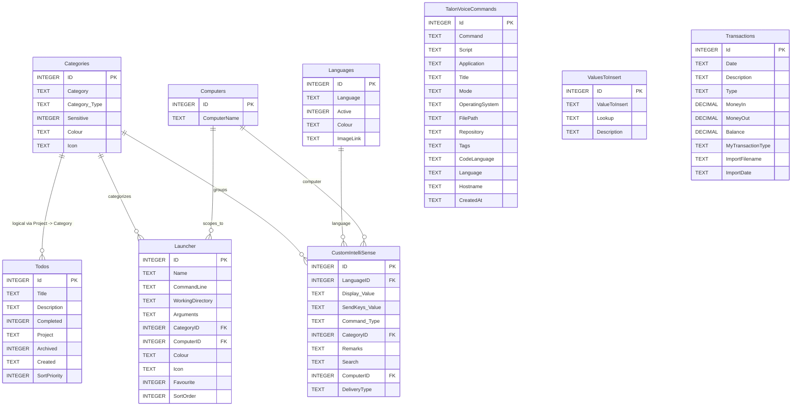

# Voice Admin Entity Relationship Diagram

This diagram reflects the main Voice Admin SQLite tables currently used by this assistant codebase.

- Declared SQLite foreign keys are shown for `Launcher` and `CustomIntelliSense`.
- `Todos -> Categories` is included as a logical application-level relationship because the code joins `Todos.Project` to `Categories.Category`, even though the database does not enforce it as a foreign key.
- `TalonVoiceCommands`, `ValuesToInsert`, and `Transactions` are currently used as standalone lookup/search tables.

## Notes

- The `Todos` join is implemented in code by matching `lower(trim(Categories.Category))` to `lower(trim(Todos.Project))`.
- `Launcher` and `CustomIntelliSense` are the most relational parts of the Voice Admin schema.
- The assistant also reads `TalonVoiceCommands`, `ValuesToInsert`, and `Transactions` directly for search and lookup workflows, but those tables do not currently expose foreign-key relationships in SQLite.